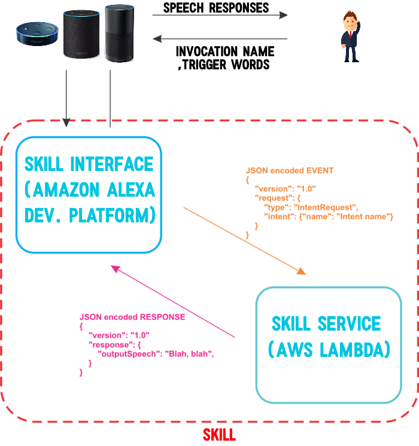

# Mighty Calculator

## Pre requisites
You need to have the latest version of Python installed. If you would like to know how to install and setup python reffer back to my video.

[](https://www.youtube.com/watch?v=GeDb_8GQTT8)

To install follow these instruction bellow
```shell script
pip install -r requirements.txt

pip install -r requirements.txt --target .package

copy calculator.py .package

copy calculator_skill.py .package

cd .package

zip -r mightycalculator.zip .

```
If there is no zip command line installed then you can use a program that can .ZIP files like WINRAR.

# Alexa Skill

[](alexa_flow.jpg)
